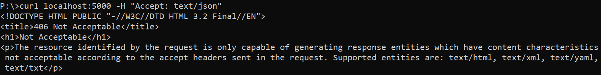

## A Web app that returns IP address
### Description

Simple web application that returns the IP address of the requesting
client, it also returns the list of client IP addresses that have queried the app in 
the past

### Installation

To use this template, your computer needs:
 
- [Python](https://www.python.org/) - version 3.8 and above
- [Pip Package Manager](https://pypi.org/)
- [Docker](https://www.docker.com/get-started) - version 20.10 and above

#### Getting started:

```sh
$ git clone https://github.com/p4wix/get-ip-app.git
```

### Launching the app without using the docker container

The website by default is accessible at http://localhost:5000/

Before running you need to install all the necessary libs from the text file `requirments.txt`
following this command
```shell
$ pip install -r requirments.txt
```

```shell
$ python app.py
```

### Launching the app using the docker container

Using the dockerfile we make the docker image by executing this command
```sh
$ docker image build -t web-app .
```

Run the container on port 5000 working in the background by using `-d`

```sh
$ docker run -p 5000:5000 -d web-app
```

> Note: You need to be in the main catalogue of the project.

The website is accessible at http://localhost:5000/

### HTTP Accept Headers

The app has the ability to adjust acceptable formats of returned HTTP Headers
`("text/html", "text/xml", "text/yaml", "text/txt")` those are the formats of
displayed content. You can verify by using  <br />
`curl localhost:5000 -H "Accept: text/xml"`  <br />


Version with not acceptable header



#### Contact
pawel.biniak9@gmail.com
